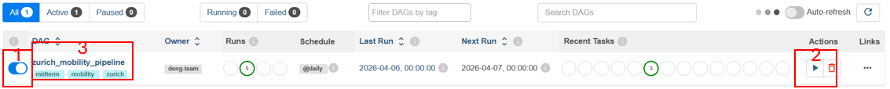
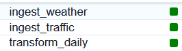

# DENG Mobility Project – Zurich Pipeline (Midterm)

## Overview

This project implements a **fully containerized data engineering pipeline** to analyze how weather influences urban mobility in Zurich.

The pipeline integrates:
* Weather data from the Open-Meteo API 
https://open-meteo.com/en/docs/historical-weather-api
* Traffic data from Zurich mobility datasets 
https://data.stadt-zuerich.ch/dataset/ted_taz_verkehrszaehlungen_werte_fussgaenger_velo 

The data is ingested, transformed, aggregated, and stored in a PostgreSQL database.
Apache Airflow is used to orchestrate the entire workflow.

---

## Use Case

**Persona:** Urban Mobility Analyst

The goal is to analyze how weather conditions influence urban mobility in Zürich.
The user needs a clean, daily aggregated dataset that combines:
* weather conditions
* mobility indicators

### Problem
The data is currently:
*  distributed across multiple sources
*  inconsistent in format
*  not directly usable for analysis

### Solution

The pipeline integrates, cleans, and aggregates the data into a unified dataset.

### What this enables
This allows analysis of patterns such as:
* How precipitation and temperature affects traffic volume
* Differences between weekdays and weekends
* Seasonal mobility trends

**The architecture below implements this use case**

---

## Architecture

### System Architecture (Overview)
```text
Docker Compose
│
├── PostgreSQL (pgdatabase)
│     └── stores raw + transformed data
│
├── pgAdmin
│     └── database UI (http://localhost:8085)
│
├── Airflow
│     └── orchestrates pipeline (http://localhost:8086)
│
└── Ingestion + Transformation (Python)
      ├── ingest_meteo.py
      ├── ingest_traffic.py
      └── transform_zurich_daily.py
```

### Data Flow
```text
         Open-Meteo API        CSV Files
                │                  │
                ▼                  ▼
        ingest_meteo.py    ingest_traffic.py
                │                  │
                └───────┬──────────┘
                        ▼
              PostgreSQL (raw tables)
                        ▼
           transform_zurich_daily.py
                        ▼
           mobility_weather_daily
                        ▼
                   pgAdmin UI
```
### Workflow (Airflow DAG)
```text
ingest_weather
ingest_traffic
        ↓
transform_daily
        ↓
mobility_weather_daily
```

---

## Reset and Restart the Project

This section describes how to stop, reset, and restart the Docker-based environment.

### Stop the Project

To stop all running containers, use:

```bash
docker compose down
```
This stops and removes the containers but keeps the stored data (volumes).

### Reset the Project
To remove all containers and volumes, use:

```bash
docker compose down -v
```

> Warning: `docker compose down -v` deletes all stored PostgreSQL data.

### Restart the Project
To start the system again after stopping or resetting:
```bash
docker compose up -d
```
This will recreate and start all services defined in the Docker Compose file.

### Reinitialize the Data
If the project was reset using -v, the database is empty and must be repopulated.
You need to rerun the ingestion pipeline, for example:
```bash
docker run --rm \
  --network=project_mobile_default \
  project_ingest:dev /app/ingest_meteo.py \
  --user=root \
  --password=meteo123 \
  --host=pgdatabase \
  --port=5432 \
  --db=meteo \
  --table=historical_weather \
  --latitude=47.3769 \
  --longitude=8.5417 \
  --start_date=2025-01-01 \
  --end_date=2025-01-07
```

Alternatively, the pipeline can be triggered via Airflow.

---
## Ingestion Pipeline

### Scripts
- ingest_meteo.py → API ingestion
- ingest_traffic.py → CSV ingestion

### Characteristics
The ingestion pipeline is batch-based, modular, reusable, and well-documented, ensuring maintainability and flexibility.

### Process
The ingestion process fetches data from APIs and CSV files, converts it into pandas DataFrames, and loads it into PostgreSQL for further analysis.

### Dockerfile.ingest
`Dockerfile.ingest` is used to build a dedicated Docker image for the ingestion scripts. It provides the required Python environment and dependencies and copies the ingestion files into the container. This allows the ingestion process to run in a reproducible and isolated environment.

### Example (Docker)
```text
docker compose up -d
```
```text
docker build -f Dockerfile.ingest -t project_ingest:dev .
```
```text
docker run --rm \
  --network=project_mobile_default \
  project_ingest:dev /app/ingest_meteo.py \
  --user=root \
  --password=meteo123 \
  --host=pgdatabase \
  --port=5432 \
  --db=meteo \
  --table=historical_weather \
  --latitude=47.3769 \
  --longitude=8.5417 \
  --start_date=2025-01-01 \
  --end_date=2025-01-07
```

---
## Local Storage (PostgreSQL in Docker)
The PostgreSQL database is running locally in Docker to store both raw and processed data.

### Access via pgAdmin
The database can be accessed through **pgAdmin**, which provides a graphical user interface for querying and managing the data.

Open pgAdmin in your browser:
```text
http://localhost:8085
```
Login-Data:
- Email: admin@admin.com
- PWD: admin123

### Connect to the Database
Right-click on **Servers → Register → Server**

Then enter:
**General**
- Name: meteo-postgres
**Connection**
- Host: pgdatabase
- Port: 5432
- Username: root
- Password: meteo123

### Query the Data
After connecting:
- Select a database (e.g., meteo or traffic_zurich)
- Right-click → Query Tool
- Run a query
```text
SELECT * FROM historical_weather LIMIT 10;
```
```text
SELECT * FROM traffic_data LIMIT 10;
```
---

## Transformations

After ingestion, both datasets undergo basic transformation steps before being stored in the final table.

### Weather Data
- Aggregated to daily level (e.g., average temperature and windspeed)
- Renamed and standardized column names
- Rounded numerical values to one decimal place for consistency

### Traffic Data
- Selected relevant columns (e.g., location, date, traffic counts)
- Standardized column names and formats
- Ensured correct data types (e.g., dates, numeric values)

### Final Dataset
- Joined weather and traffic data on the date field
- Created a unified table for downstream analysis
- Ensured clean and consistent schema across all columns

These transformations ensure that the data is clean, consistent, and ready for analysis and visualization.

---

## Architecture

The project is fully containerized using Docker Compose.

**Components:**

* PostgreSQL → data storage
* pgAdmin → database UI
* Airflow → pipeline orchestration

**Pipeline (Airflow DAG):**

```
ingest_weather  →  
                  → transform_daily → mobility_weather_daily
ingest_traffic  →
```

---

## Project Structure

```
project_mobile/
│
├── dags/
│   └── zurich_pipeline.py
│
├── ingest_meteo.py
├── ingest_traffic.py
├── transform_zurich_daily.py
│
├── docker-compose.yml
├── Dockerfile.ingest
│
├── initdb/
│   └── create_databases.sql
│
├── data/
│   └── traffic_zurich.csv
│
└── README.md
```

---

## Setup Instructions

### 1. Start the system

Start Docker Desktop

```bash
docker compose up -d
```

---


### 2. Configure pgAdmin

```
http://localhost:8085
```

Login-Data:
- Email: admin@admin.com
- PWD: admin123

Create a new server with:

### General tab

* **Name:** `meteo-postgres`

### Connection tab

* **Host name/address:** `pgdatabase`
* **Port:** `5432`
* **Maintenance database:** `meteo`
* **Username:** `root`
* **Password:** `meteo123`

---

## Running the Pipeline

### 1. Open Airflow UI

Go to:

```
http://localhost:8086
```

* Username: `admin`
* Password: `admin`

---

### 2. Enable and Trigger the DAG

* Find the instance: `zurich_mobility_pipeline`
1) Toggle it ON (unpause)
2) Click the play button
3) Click on the DAG name to see the pipeline run



---

### 4. Monitor execution

* All of the three tasks should turn **green** after some time.
* Tasks:

  * ingest_weather
  * ingest_traffic
  * transform_daily



* If all tasks are **green**, The table is built and can be queried in pgAdmin in the database **traffic_zurich**.

---

## Data Output

The final table: **mobility_weather_daily**


Contains:

* date
* avg_temperature
* total_precipitation
* avg_windspeed
* traffic metrics (velo, fuss, etc.)
* calendar features (weekday, weekend, month)

---

## Verification

Run in pgAdmin (in the Database: **traffic_zurich**):

```sql
SELECT COUNT(*) FROM mobility_weather_daily;
```

Expected:

```
365 rows
```

---

```sql
SELECT * FROM mobility_weather_daily LIMIT 10;
```

---

## Manual Execution (Fallback)

If Airflow is not used, scripts can be executed manually:

```bash
python ingest_meteo.py
python ingest_traffic.py
python transform_zurich_daily.py
```

---

## Reproducibility

To reproduce the project (overview):

1. Clone repository
2. Run:

   ```bash
   docker compose up -d
   ```
3. Open Airflow
4. Trigger DAG
5. Validate results in pgAdmin

---

## Notes

* This midterm focuses on the Zurich pipeline only
* Basel-related components are not used
* This midterm focuses on the local pipeline (PostgreSQL + Airflow). Cloud storage and Terraform-based infrastructure will be implemented in the final stage.
* The pipeline is designed to be fully reproducible

---

## Future Improvements

* Add cloud-storage (will be done after midterm)
* Extend to multiple cities (e.g., Basel)
* Add more data sources
* Improve feature engineering
* Build dashboards on top of the dataset

---

## Authors

* Susanne Pfenninger
* Diego Gonzalez
